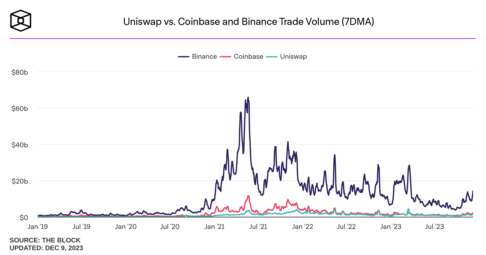

# Lending nAAn

## Description

Lending nAAn is a lending and borrowing Omnidapp powered by Account Abstraction. Our goal was to create a fully decentralized lending and borrowing platform with the user-friendly UX of centralized platforms. Instead of focusing on DeFi power users, who make up only 1% of all crypto-native users, we're targeting the remaining 99% and all non-crypto native (web2) users yet to discover the beauty of DeFi.

## How are we able to provide a centralized platform feel on a completely decentralized platform?

By using the Safe AA module, we can onboard users with just their email and immediately create wallets for them. Additionally, we're using Pimilico to enable gasless transactions. So, the entire "connect wallet/sign transaction" process is abstracted from the user. Also, by simplifying the UI and making certain decisions for the users (such as health factor when borrowing or the best loan provider), using our Dapp feels like using any other web2 app.

## And what's with the Omnidapp thing?

Even though it's beyond the scope of this hackathon, our users will be able to access the best deposit and borrowing options because we will integrate many different lending and borrowing platforms. That means that as a user, you'll be able to interact with all of them from a single Dapp, i.e., Lending nAAn. For this hackathon, we have only integrated Aave, though.

## Why even make a fully decentralized lending and borrowing platform that feels like centralized platforms?

Even though power users or whales sometimes seem responsible for the major funds circulation compared to shrimps, and many protocols and projects are actually focusing on this 1%, it's still nothing compared to what's happening on CEXs:



## What's after the hackathon? (versioning)

### MVP (hackathon version)
Integrate only Aave for landing and borrowing. Add AA for easy onboarding, gasless transactions and use Safe onramp kit so user can buy crypto with their credit cards.

### Lending nAAn v1
Fix bugs. Simplify UX even more after gathering feedback. Make notification systems about liquidation risk and on click risk mitigation or even opting in auto resolving. Integrate more lending and borrowing protocols like Aave to get the best prices for the users and turn Lending nAAn into true Omnidapp.

### Lending nAAn v2
Go multichain and cross chain providing option of depositing on one chain and getting the loan on another.

---
## Demo

## What tech did we use and what bounties we apply for?

### Safe
```
Bounties:

- SAFE{CORE} AA SDK
- Safe 4337 Module integrated with Pimlico


Tech used:

SAFE{CORE} AA SDK
We use this component to sing up and sign in users with their emails automatically crating wallets for them.

Onramp kit

Pimlico
We use Pimlico with account created wth SAFE{CORE} AA SDK for gasless transactions
```

### MetaMask & Linea
```
Bounties:

- Best Gas API Application (Fetch Real-Time Gas Prices)


Tech used:

MetaMask SDK
We use MetaMask SDK to enable option of connecting and interacting with the dapp using MetaMask. 

Gas API
We use Gas API to fetch Real-Time Gas Prices and diplay it in the dapp navigation.

Linea
We have deployed our contract on Linea testnet at the address 0x262d7a5bee15e9e9fea0c0439da4dac9056e178e
```

### Graph
```
Bounties:

- Best Use of Subgraph


Tech used:

Subgraphs

```

### Airstack
```
Bounties:

- Best overall use of Airstack APIs

Tech used:

Airstack SDK
Airstack SDK is used with useGetWalletENS to fetch ens domains once the user is singed in and display it in the navigation instead of the address.
```

### Mantle
```
Bounties:

- Best DeFi Project
- Best UX

Tech used:
We have deployed our contract on Mantle Tesnet at the address 0x5A5B14594f1BF93656a2B705ECdb873373A4eFe9
Link on explorer: https://explorer.testnet.mantle.xyz/tx/0x9c01abf33d7edcfa248ae94e06b3c3e18f048c160c05b0d4265e77d387c27ec9
```

### Celo
```
Bounties:

- Best dApps on Celo Blockchain

Tech used:
We have deployed our contract on Celo Alfajores at the address 0x7c337d52a2425f277b371fe79ca2ced02744836a
```

### Polygon
```
Bounties:

- Polygon zkEVM DeFi Challenge

Tech used:
We have deployed our contracts on Polygon Mumbai at the addresses:
0x5A5B14594f1BF93656a2B705ECdb873373A4eFe9 oven
0x7C337d52a2425f277b371Fe79CA2CEd02744836A adapter

We couldn't use Polygon zkEVM because Aave is not supported.
```

### Scroll
```
Bounties:

- Deploy on Scroll
- Best on Scroll 

Tech used:
We have deployed our contracts on Scroll Sepholia at the addresses:
0xcf17664006851A27d5Bd93d497f30853AC558792 oven
0x262D7a5BEE15E9E9fEa0C0439dA4DAC9056e178E adapter

Links on explorer:
https://sepolia.scrollscan.com/tx/0x10a6b841ecf63d67365ce3dad4ec3252246c80f07282d06a56effa4006da1fc9
https://sepolia.scrollscan.com/tx/0x2c94148244b6297dfed90c1e4f75e9ce333849851a052ffded98a4b71d3efb59
```

### Arbitrum
```
Bounties:

- Most Original
- Best Technology
- Pool Prize

Tech used:

We have deployed our contracts on Arbitrum Goerli at the addresses:
0xad2e65a73b714d5c5f5a49a388023cd36e0443db oven
0x694a170115a014807a93bdfa4c41547fbad906e3 adapter
```

### Base
```
Bounties:

- Build a Consumer Product

Tech used:
We have deployed our contract on Base Goerli at the addresses 0xcf17664006851A27d5Bd93d497f30853AC558792
```